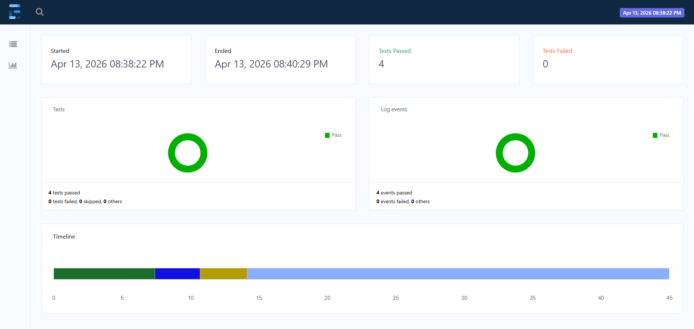
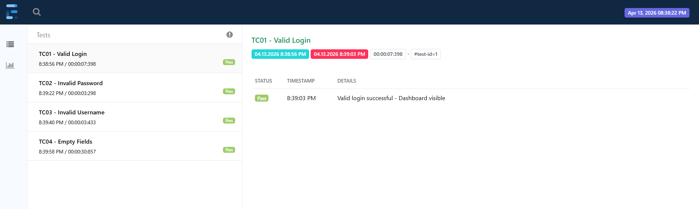
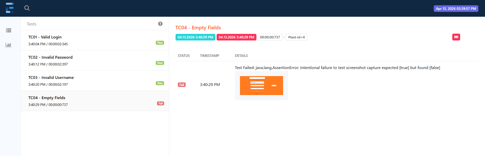
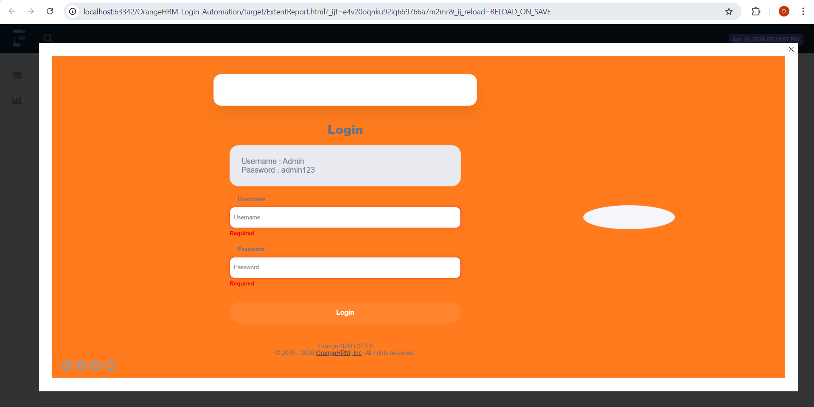

# OrangeHRM Login Automation 🚀

A professional Java-based Test Automation Framework built to automate the login functionality of the **OrangeHRM** demo portal. Demonstrates the **Page Object Model (POM)** design pattern for maintainable and scalable automation scripts.

### ✨ Key Features
- **Design Pattern:** Page Object Model (POM) for better code organization
- **Framework:** Built using **Selenium WebDriver** and **TestNG**.
- **Reporting:** Integrated **Extent Reports** for interactive and visual HTML test reports.
- **Auto Screenshot on Failure:** Screenshots automatically captured and attached to the report on test failure
- **Build Tool:** Managed dependencies using **Maven**.

### 🛠️ Tech Stack
* **Language:** Java 17
* **Automation:** Selenium WebDriver 4.18.1
* **Testing Framework:** TestNG 7.9.0
* **Reporting:** Extent Reports 5.1.1
* **Build Tool:** Maven
* **Utilities:** Apache Commons IO (for screenshots)

## 📁 Project Structure
```
SeleniumLearning/
├── src/
│   └── test/
│       └── java/
            ├── base/
│           │   └── BaseTest.java
│           ├── pages/
│           │   └── LoginPage.java
            ├── tests/
│           │   └── LoginTest.java
│           └── utils/
│               └── ExtentManager.java 
                └── ScreenshotUtils.java
├── pom.xml
└── .gitignore
```

## 🧪 Test Scenarios

| TC | Scenario | Expected Result | Status |
|---|---|---|---|
| TC01 | Valid Login | Dashboard visible | ✅ Pass |
| TC02 | Invalid Password | Error message shown | ✅ Pass |
| TC03 | Invalid Username | Error message shown | ✅ Pass |
| TC04 | Empty Fields | Required error shown | ✅ Pass |

### 📸 Test Evidence & Reporting
The framework generates a detailed HTML report after every execution. It provides clear insights into which tests passed or failed.

#### **1. Overall Test Summary**
The dashboard provides a high-level view of the test execution results.


#### **2. Detailed Test Logs**
Each test case is logged with specific details and pass/fail statuses.


#### **Failure Evidence & Automatic Screenshots**
One of the core features of this framework is the ability to capture and embed screenshots automatically upon test failure.

* **Embedded Screenshot in Report:** When a test fails, the reason for failure and the screenshot are displayed together.


* **Detailed View:** You can click and expand the screenshot to see the exact UI state at the time of failure.



## ▶️ How to Run

1. Clone the repository:
```
   git clone https://github.com/AAKDIVYANGANA/orangehrm-login-automation.git
```

2. Open in IntelliJ IDEA

3. Run Maven install:
```
   mvn clean install -U
```

4. Run LoginTest.java using TestNG

5. View the report: open target/ExtentReport.html

## 📌 Notes

- Chrome browser is required
- Selenium Manager automatically handles ChromeDriver setup
- Test site used: OrangeHRM Demo (opensource-demo.orangehrmlive.com)

## 👩‍💻 Author

**Ahinsa Divyangana**
